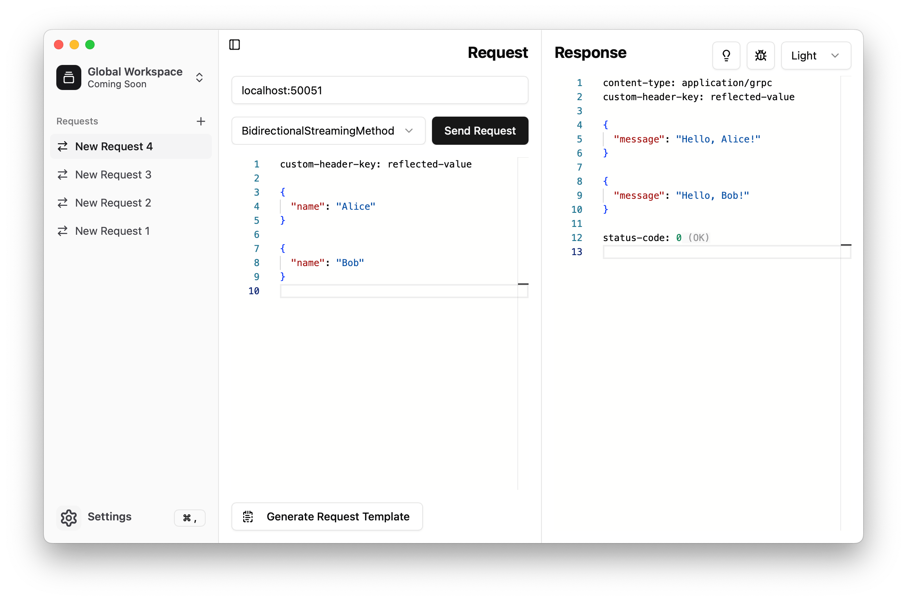

# grpcmd-gui

[*(If you're looking for a gRPC CLI tool, check out: **grpcmd**)*](https://github.com/grpcmd/grpcmd)

## Demo

## Features
- Supports fetching methods from reflection.
- Supports sending request headers.
- Supports viewing response headers and trailers.
- Supports generating a request template in JSON.
- Supports streaming request and response messages.
- Supports customization via multiple themes.

## Installation

### Homebrew
    brew install --cask grpcmd/tap/grpcmd-gui
The above command will install the `grpcmd-gui` package from the tap [`grpcmd/tap`](https://github.com/grpcmd/homebrew-tap).

### Binary
You can also download the binary files for macOS, Linux, and Windows from the [Releases](https://github.com/grpcmd/grpcmd-gui/releases) page.
